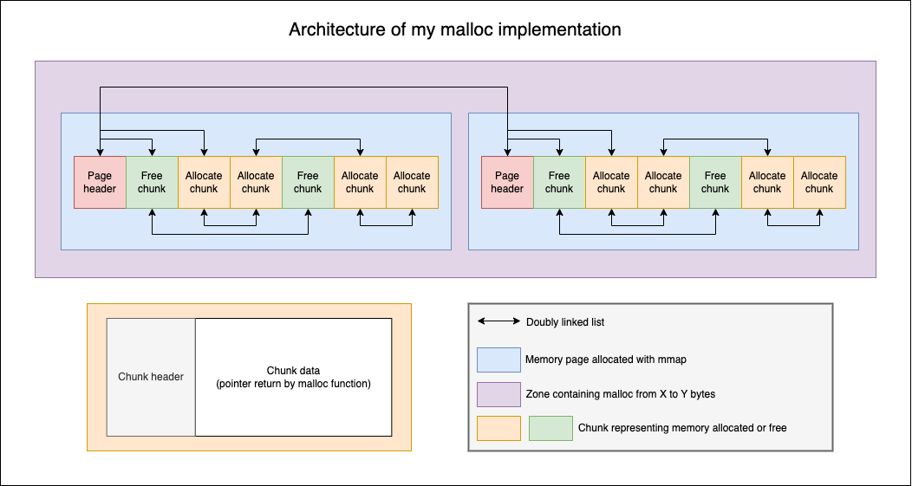

# 42 Malloc

A custom implementation of the `malloc`, `free`, `realloc`, `calloc` and `reallocarray` memory allocation functions, built as part of the 42 school curriculum. This project implements a zone-based memory allocator using `mmap` for efficient memory management.



## Features

- **Zone-based allocation**: Three types of zones for optimized memory management:
  - **TINY**: Allocations up to 64 bytes
  - **SMALL**: Allocations up to 2048 bytes
  - **LARGE**: Allocations larger than 2048 bytes
- **Memory alignment**: All allocations are aligned to `sizeof(size_t) * 2` bytes
- **Chunk management**: Efficient chunk-based memory organization with linked lists
- **Memory debugging**: `show_alloc_mem()` function to display current memory allocations
- **Thread-safe**: All API functions are thread-safe and can be safely used in multi-threaded applications
- **Cross-platform**: Supports both Linux and macOS

## Building

### Prerequisites

- GCC compiler
- Make
- Valgrind (for testing on Linux)

### Build as Shared Library

To build the shared library:

```bash
make
```

This will create `libft_malloc_<HOSTTYPE>.so` (e.g., `libft_malloc_x86_64_Linux.so`) and a symbolic link `libft_malloc.so`.

### Build Tests

To build and run tests with Valgrind:

```bash
make tests
```

This will:
1. Compile the test suite
2. Run tests with Valgrind to check for memory leaks and overflows

### Clean Build Artifacts

```bash
make clean      # Remove build directory
make fclean     # Remove build directory and binaries
make re         # Clean and rebuild
```

## Usage

### As a Shared Library

1. Build the library:
   ```bash
   make
   ```

2. Link your program with the library:
   ```bash
   gcc your_program.c -L. -lft_malloc.so -o your_program
   ```

3. Run with the library:
   ```bash
   LD_PRELOAD=./libft_malloc.so ./your_program
   ```

### API

The library provides the standard memory allocation functions. All functions are **thread-safe** and can be safely called from multiple threads concurrently:

```c
#include "malloc.h"

// Allocate memory
void *malloc(size_t size);

// Free allocated memory
void free(void *ptr);

// Reallocate memory
void *realloc(void *ptr, size_t size);

// Allocate and zero-initialize memory
void *calloc(size_t nmemb, size_t size);

// Reallocate memory with array size checking
void *reallocarray(void *ptr, size_t nmemb, size_t size);

// Display current memory allocations (debug function)
void show_alloc_mem();
```

### Example

```c
#include "malloc.h"
#include <stdio.h>

int main(void) {
    // Allocate memory
    int *arr = (int *)malloc(10 * sizeof(int));
    if (arr == NULL) {
        fprintf(stderr, "Memory allocation failed\n");
        return 1;
    }

    // Use the memory
    for (int i = 0; i < 10; i++) {
        arr[i] = i;
    }

    // Reallocate to a larger size
    arr = (int *)realloc(arr, 20 * sizeof(int));

    // Free the memory
    free(arr);

    // Display memory allocations (debug)
    show_alloc_mem();

    return 0;
}
```

## Architecture

### Zone System

The allocator uses three types of zones:

1. **TINY Zone**: For allocations ≤ 64 bytes
   - Each zone can hold up to 100 allocations
   - Zone size: `(64 + chunk_header_size) * 100 + page_header_size`

2. **SMALL Zone**: For allocations ≤ 2048 bytes
   - Each zone can hold up to 100 allocations
   - Zone size: `(2048 + chunk_header_size) * 100 + page_header_size`

3. **LARGE Zone**: For allocations > 2048 bytes
   - One allocation per zone
   - Zone size: `allocation_size + chunk_header_size + page_header_size`

## Code Formatting

Check code formatting:
```bash
make check-format
```

Format code:
```bash
make format
```
